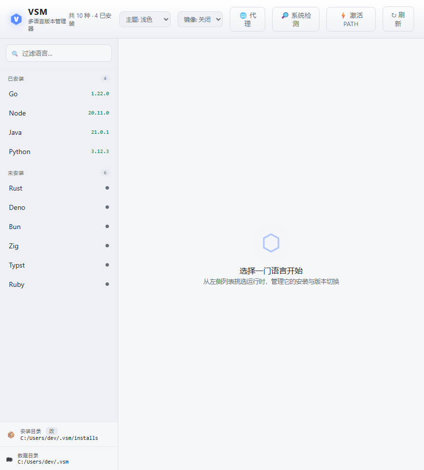
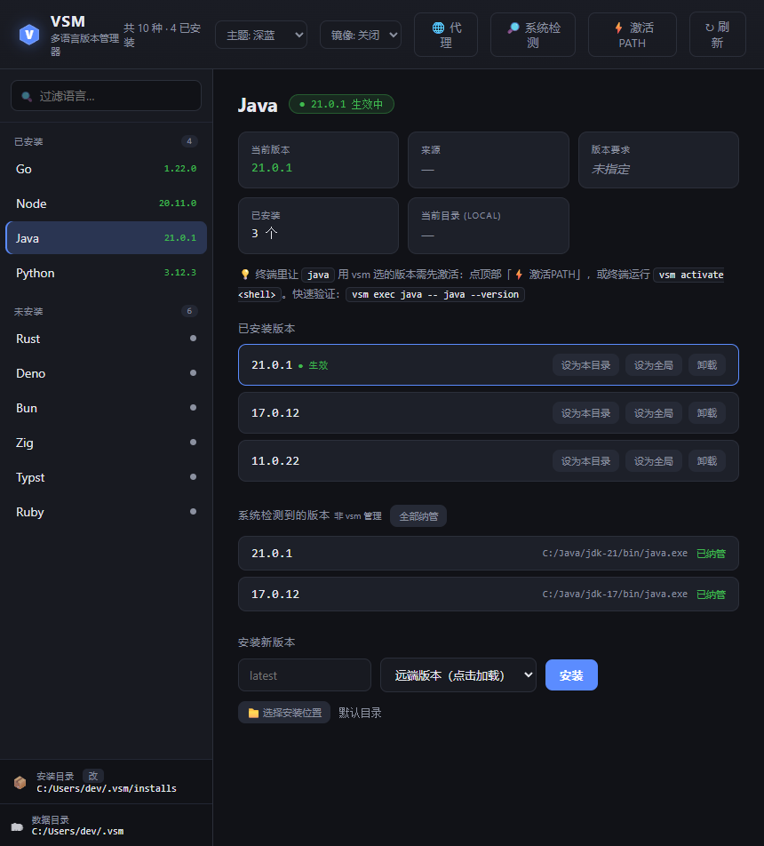
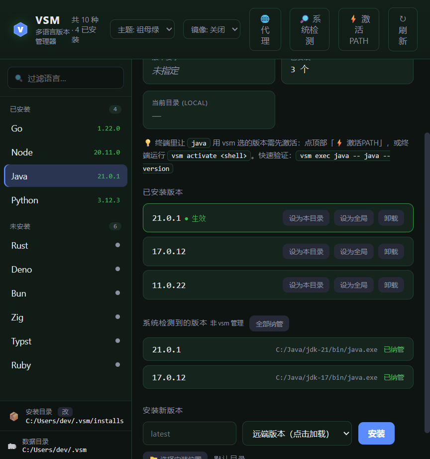
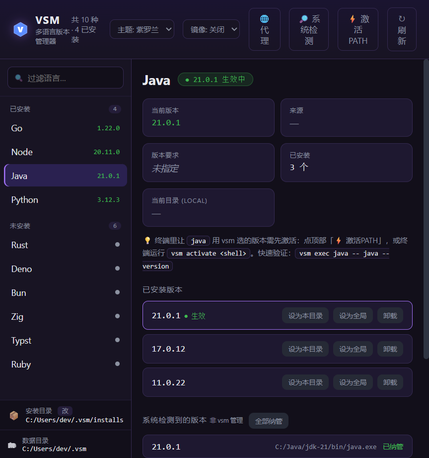

# 为什么你需要一个语言版本管理器?——从一台机器装了 4 个 JDK 说起

> 说明:本文中所有命令输出均为**脱敏示例**(路径、用户名等已替换为通用占位),仅用于演示效果。
> 项目地址:https://github.com/hquip/Vaelen

---

## 写在前面

如果你是个每天在多个项目之间来回切的开发者,这篇文章大概率说中你的痛。它分三部分:

1. **为什么**——为什么"语言版本管理与切换"是绕不开的刚需(占全文一半,讲透动机);
2. **怎么做**——版本管理器到底要解决哪些问题,业界是怎么做的;
3. **vsm 的解法**——一个纯 Go、零依赖、把 Windows 和"已装环境"当一等公民的版本管理器。

不想看长篇大论的,可以直接跳到第六节看命令。但我更建议你读完"为什么",因为很多人用不好版本管理器,恰恰是因为没想清楚它在解决什么。

---

## 一、先问一个扎心的问题:你机器上有几个 Node?几个 JDK?

打开你的开发机数一数,大概率不止一个:

- 一个三年前的老项目还钉在 Node 16,上个月新起的服务已经用上了 Node 22;
- 公司内网那套祖传系统是 JDK 8 编译的,新拆出来的微服务用 JDK 17,而你自己手痒想试试 JDK 21 的虚拟线程;
- 这个仓库 `pyproject.toml` 写着 `requires-python = ">=3.10"`,隔壁数据团队的脚本只在 3.12 上跑得起来;
- Go 更直接——`go.mod` 第一行就写死了 `go 1.21`,换个仓库立刻变成 `go 1.23`。

**多版本共存,从来不是"洁癖",而是现代开发的默认状态。** 真正棘手的问题是:这些版本怎么在同一台机器上和平共处、怎么保证你在对的项目里用上对的那一个、切换的时候怎么不出错。

这一整套事情,就叫"语言版本管理与切换"。下面我们一层层拆开:为什么它非要不可。

---

## 二、为什么"装一个最新版"远远不够

新手最常见的想法是:"我直接装个最新版,一劳永逸不就好了?"现实会在三天内教育你。

### 2.1 项目和运行时是强耦合的

版本从来不是"越新越好",而是"**项目要哪个,就必须是哪个**":

- **依赖装不上**:某个 npm 原生模块只为 Node 18 提供了预编译二进制,你在 Node 22 上 `npm install` 直接编译失败;某个 Python 库用了 3.10 才有的 `match` 语法,你在 3.9 上连导入都报错。
- **构建产物对不上**:团队约定用 JDK 17 编译,你用 JDK 21 编出来的 class 文件版本号是 65,部署到只认 61 的环境直接 `UnsupportedClassVersionError`。
- **线上问题复现不了**:生产环境是 Go 1.21,你本地 1.23,某个标准库的细微行为差异,导致那个诡异的 bug "在我机器上怎么都复现不出来"。

### 2.2 语言演进太快,新旧项目被活活撕裂

Node 基本一年一个大版本,Python 一年一个 minor,Go 半年一发,Java 半年一个 feature release。新项目想吃新特性,老项目却一升级就炸——谁敢动那套没人维护、没有测试的祖传代码?

于是同一个工程师,**上午还在 Node 22 上写新服务的 async 特性,下午就得切回 Node 16 去修一个老系统的线上 bug**。这种横跳,是绝大多数人的日常,不是个例。

### 2.3 "全局只留一个版本" = 灾难

如果你的机器全局只能有一个版本,那意味着每切一个项目,你就要"卸了装、装了卸"。这不仅荒谬,而且极其浪费时间——一次 JDK 安装好几百 MB,一天切五次,光等进度条就够喝一壶。

正确的心智模型是:**版本应该跟着项目走**。

- 进到项目 A 的目录,`node` 自动是 16;
- `cd` 到项目 B,`node` 自动变成 22;
- 你脑子里完全不用记"现在是哪个版本",工具会根据你所在的目录,自动解析并切换。

这就是"版本切换"最核心的价值:**按上下文(目录/项目)自动给出正确的版本**,而不是让你用全局状态去手动对齐。

---

## 三、那"手动切换"为什么也不行?

总有人说:"我自己管还不行吗?装在不同目录,用的时候改一下环境变量。"——试过的人都知道这条路有多痛。

### 3.1 手动改 PATH / 环境变量,既繁琐又危险

- 切个 Java,要同时改 `JAVA_HOME` 和 `PATH`,改完往往还得重开终端才生效;
- PATH 里堆了好几个版本的目录,顺序一乱,`where java` / `which java` 出来的不是你以为的那个,排查半天;
- Windows 上改系统环境变量要点开一层层对话框,改错一个分号可能影响一堆其它软件;
- 项目切来切去,半年后你自己都说不清"当前这个终端到底激活的是哪个版本";
- 想卸载某个版本,残留的环境变量、目录、缓存散落各处,越积越脏。

**手动管理的本质,是让人去做机器最擅长、最不该让人做的事。**

### 3.2 单语言工具的"碎片化地狱"

为了缓解上面的痛,社区出了一堆**单语言**管理器:`nvm` 管 Node、`pyenv` 管 Python、`jenv` 管 Java、`gvm` 管 Go、`rbenv` 管 Ruby……

它们各自都不错,但合在一起就是另一种痛:

- **认知负担爆炸**:每个工具一套命令、一套配置文件、一套激活机制,你得同时记住四五套,经常张冠李戴;
- **启动变慢**:每个工具往 shell 里塞一段 hook,叠在一起,开个终端要等半秒;
- **互相打架**:它们都改 PATH,顺序冲突时行为难以预测;
- **迁移成本高**:换台新机器,你要把这一整套"管理工具的工具"重新装一遍、配一遍。

这就是为什么会出现**统一的多语言版本管理器**——用一套命令、一份配置,把所有语言管起来。业界代表有 asdf、mise、vfox,以及本文的主角 **vsm**。

---

## 四、版本管理器到底要解决哪三件事

把所有花哨功能剥掉,一个版本管理器的核心职责只有三件:

1. **install(装)**:把指定版本下载、解压到一个**互相隔离**的目录,绝不污染系统、也不让多个版本互相干扰;
2. **resolve(选)**:在你当前所在的目录下,按一套**优先级规则**解析出"此刻应该用哪个版本";
3. **activate(用)**:让 `go` / `node` / `java` 这些命令,真正指向上一步解析出来的那个版本。

`nvm`/`pyenv` 是为单一语言做这三件事;统一管理器把它们收敛成一套通用机制。理解了这三件事,你就理解了所有版本管理器的骨架。

下面看 vsm 是怎么做这三件事的——以及它多走的、别人没走的关键一步。

---

## 五、vsm 是什么,以及它的设计取舍

**vsm**(Versatile Versions Manager)是一个用**纯 Go 标准库**写的多语言版本管理器,核心追求**全链路零 CGO**。这几个词背后是实打实的好处:

- **零 CGO + 纯标准库**:CLI 没有任何第三方依赖,一次代码、一键交叉编译出 Windows / Linux / macOS 全平台的**单个可执行文件**。下载下来扔进 PATH 就能用——不需要 bash、不需要 git、不需要 curl、更不需要任何语言运行时。
- **对比 asdf**:asdf 是一堆 bash 脚本 + 各语言的 git 插件,依赖系统的 git/curl/各种构建工具,在 Windows 上基本要靠 WSL 才能跑。vsm 是原生单体,Windows 直接双击就行。
- **兼容 asdf 的 `.tool-versions`**:老项目的配置文件不用改,迁移成本接近于零。

下面是它的桌面 GUI 主界面(Windows):



但 vsm 真正的差异化,不在"又一个版本管理器",而在它对"已有环境"的态度。

---

## 六、核心差异:先"发现并接管"你机器上已有的一切

大多数版本管理器的世界观是"**一切从我装的开始**"。你过去手动装的 JDK、系统自带的 Python、IDE 顺手塞进来的 Node——它们一概不认。你想用?可以,在我的体系里**重新下载、重新装一遍**。

这其实很荒谬:东西明明就在机器上,为什么要重来一遍?

vsm 反过来,**第一步是盘清现状**:

```bash
vsm detect
```

输出大致是这样(脱敏示例路径):

```
go       1.26.1         C:\tools\go\1.26.1\bin\go.exe
go       1.25.11        C:\tools\go\1.25.11\bin\go.exe
java     21.0.1         C:\Java\jdk-21\bin\java.exe
java     17.0.12        C:\Java\jdk-17\bin\java.exe
java     11.0.22        C:\Java\jdk-11\bin\java.exe
java     1.8.0          C:\Java\jdk-8\bin\java.exe
node     25.8.0         C:\tools\node-v25\node.exe
node     20.17.0        C:\tools\node-v20\node.exe
python   3.10.9         C:\Python\python310\python.exe
```

这一条命令背后,藏着几个和同类拉开差距的细节:

- **同一语言的多个版本全部识别**:java 的 4 个版本(21/17/11/1.8)一个不落,而不是只取 PATH 里排第一的那个;
- **双路发现**:它不仅遍历整个 `PATH` 的每一个目录,还会从 `JAVA_HOME` / `GOROOT` / 各种 `*_HOME` **环境变量直接定位**运行时——哪怕这个版本根本没被加进 PATH;
- **主动避坑**:自动跳过 Windows 那种 0 字节的"应用执行别名"(`WindowsApps` 目录下那个指向商店、其实是假的 `python.exe`),不会误报;
- **合并去重**:PATH 和环境变量发现了同一个运行时,只算一次。

发现之后,关键是**一键接管,而且不重装**:

```bash
vsm adopt --all
```

它用链接(Windows 上是 junction)把这些系统版本纳管进 vsm——**不重新下载一个字节、不挪动你原来的目录**。纳管后立刻就能 `use` / 切换;哪天不想要了,卸载也**只删链接,绝不碰你系统里的真实目录**。

在 GUI 里,某个语言的"已安装版本"和"系统检测到的版本(可一键纳管)"是这样并排呈现的:



> 一句话总结:**别人从零开始装,vsm 从你机器的现状开始管。**

---

## 七、完整功能详解

### 7.1 install:下载这件"小事",其实没那么简单

`vsm install go 1.22.0` 看着简单,底层做了不少脏活:

- **并行分块下载**:用 HTTP Range 把大文件切成多块(默认 4 连接)并行拉,小于 8MB 的不分块、避免徒增连接开销;
- **自动回退**:服务器不支持 Range?自动退回单连接流式下载,不会失败;
- **失败重试 + 完整性校验**:默认重试 3 次;对有官方校验值的(如 Go)做 **sha256 校验**,防止下到损坏包;
- **跟随重定向 + 魔数纠正**:GitHub、Adoptium 这类源重定向后常常丢掉 `.zip`/`.tar.gz` 后缀,vsm 会读文件头的魔数把格式纠正回来,确保用对解压器;
- **跨平台解压**:`.zip` / `.tar.gz` 纯 Go 解压(带 zip-slip 路径穿越防护);`.tar.xz`(zig、typst 等在 Linux/macOS 的格式)则调用系统 `tar`,不引入第三方依赖。

内置 **73 种语言/工具**,其中 17 种可直接安装,其余支持识别与版本切换——补上下载源即可变为可安装。

### 7.2 use / current / which / exec:日常四件套

```bash
vsm use -g node 20         # 设为全局默认
vsm use go 1.22.0          # 设为当前目录版本(写入 .tool-versions)
vsm current                # 列出每个语言当前生效的版本及其"来源"
vsm which go               # 打印当前 go 的真实路径
vsm exec go version        # 在解析出的版本环境下执行命令
```

`current` 的"来源"很贴心——它会告诉你当前版本到底是被哪条规则解析出来的(全局?目录配置?还是 go.mod?),排查"为什么是这个版本"时一目了然。

### 7.3 resolve:版本解析的优先级,贴着真实工程习惯设计

这是版本切换的灵魂。vsm 的解析优先级(从高到低):

1. 环境变量 `VSM_<TOOL>_VERSION`(如 `VSM_GO_VERSION=1.22`,适合临时覆盖、CI 场景);
2. 从当前目录**向上逐级查找**的 `.tool-versions`,以及各生态的**惯用版本文件**:
   - `.nvmrc` / `.node-version`、`.python-version`、`.ruby-version`、`.java-version`、`.go-version`、`.sdkmanrc`;
   - 甚至直接读构建文件:`go.mod` 的 `go x.y`、`package.json` 的 `engines.node`、`pyproject.toml` 的 `requires-python`、`Gemfile`、`runtime.txt`;
3. 全局 `~/.vsm/.tool-versions`。

这意味着:**你 clone 一个老仓库、不写任何 vsm 专属配置,它也能照着 `go.mod` / `.nvmrc` 自动选对版本。** 零配置、零侵入。

### 7.4 activate:hook 为主,shim 兜底

- **shell hook**:`vsm activate bash`(或 zsh / powershell)注入一段 hook,你一 `cd` 进带版本配置的目录,PATH 自动指向对应版本——这就是"进目录自动切换"的体验来源;
- **shim 兜底**:在 IDE、CI 这种没有 shell hook 的环境,vsm 在 `~/.vsm/shims` 放一层垫片,保证命令仍能解析到正确版本。

两条腿走路,覆盖从终端到 IDE 到 CI 的所有场景。

### 7.5 多版本隔离

每个版本独立存放在 `~/.vsm/installs/<tool>/<version>`,互不干扰。切换版本只是改"指针",不重装。安装根目录还能整体迁到别的盘(`vsm install-root D:\sdk`),给 C 盘减负。

### 7.6 扩展一门语言:不用写代码

新增语言不需要改源码、不需要写 Lua/bash 插件。往 `~/.vsm/plugins/` 丢一个 JSON manifest 即可:

```json
{
  "name": "deno",
  "source": { "type": "github-releases", "repo": "denoland/deno", "stripPrefix": "v" },
  "url": "https://github.com/denoland/deno/releases/download/v{version}/{asset}",
  "assets": {
    "windows/amd64": "deno-x86_64-pc-windows-msvc.zip",
    "linux/amd64":   "deno-x86_64-unknown-linux-gnu.zip",
    "darwin/arm64":  "deno-aarch64-apple-darwin.zip"
  }
}
```

`{version}` / `{os}` / `{arch}` / `{asset}` 会自动展开。要支持几十种语言,只是往目录里加 JSON 而已。

### 7.7 桌面 GUI(Windows)

不爱命令行?vsm 提供一个 Wails + WebView2 的桌面 GUI:语言列表、安装/卸载、系统检测与一键纳管、镜像/代理切换、安装进度条、当前目录 local 版本设置、一键写入用户级 PATH,还内置**多套配色主题**(深蓝/纯黑/祖母绿/紫罗兰/琥珀/玫红/浅色)随心换。

同一个界面,切换主题后背景与配色会整体随之改变:





### 7.8 Windows 一等公民

- 多版本隔离用 **junction**,卸载安全、不留垃圾;
- `vsm path-init` 把 shims 目录写入**用户级 PATH 并广播系统通知**,新开的终端立刻生效,不用手动改环境变量;
- 配合 GUI,Windows 用户几乎可以全程鼠标操作。

### 7.9 国内网络友好

```bash
vsm mirror cn                       # go.dev/nodejs.org/github 全走国内镜像(下载与元数据都重写)
vsm proxy http://127.0.0.1:7890     # 所有请求走代理,支持 http / https / socks5
vsm proxy off                       # 强制直连
vsm proxy system                    # 跟随系统环境变量
```

镜像是 URL 重写层、代理是传输层,两者正交、可叠加。环境变量 `VSM_MIRROR` / `VSM_PROXY` 优先于配置文件,方便 CI 临时覆盖。

---

## 八、为什么选 vsm:和主流工具的客观对比

| 维度 | nvm/pyenv | asdf | mise | **vsm** |
|------|-----------|------|------|---------|
| 覆盖语言 | 单语言 | 多语言 | 多语言 | **多语言(内置 73)** |
| 发现系统已装 | ✗ | ✗ | 部分 | **✓ PATH + 环境变量双路** |
| 同语言多版本识别 | 单语言 | ✗ | 部分 | **✓** |
| 一键纳管(不重装) | ✗ | ✗ | ✗ | **✓ adopt** |
| 运行依赖 | 各异 | bash/git/curl | 无 | **无(纯标准库)** |
| Windows | 各异 | 基本需 WSL | 支持 | **原生 + 桌面 GUI** |
| 扩展方式 | — | bash 插件 | 后端/插件 | **JSON manifest(免写码)** |
| 配置格式 | 各自 | `.tool-versions` | `.tool-versions`/toml | **`.tool-versions`(兼容 asdf)** |
| 国内加速 | ✗ | ✗ | ✗ | **镜像 + 代理** |

**客观地说**:asdf 的插件生态最成熟,社区插件覆盖最广;mise 用 Rust 写,性能和体验都很强。vsm 不打算在"插件数量"上和它们硬碰,它的差异化非常聚焦:

- **发现并接管已有环境**(detect + adopt)——这是它最独特的地方;
- **零依赖单体**——一个文件,跨平台一致;
- **Windows 一等公民**——含桌面 GUI;
- **对国内网络友好**——镜像 + 代理开箱即用。

---

## 九、快速上手:5 分钟跑通

```bash
# 1. 先盘清机器现状,把已装的都接管进来
vsm detect
vsm adopt --all

# 2. 装个新版本
vsm install go 1.22.0

# 3. 设版本
vsm use -g node 20         # 全局默认
vsm use go 1.22.0          # 当前项目(写 .tool-versions)

# 4. 开启"进目录自动切换"
vsm activate bash >> ~/.bashrc     # 或 vsm activate powershell

# 5. 验证
vsm current
vsm exec go version
```

---

## 十、几个常见疑问(FAQ)

**Q:它会不会把我现有的环境搞乱?**
A:不会。`adopt` 全程只建链接,不动你原始目录;卸载纳管版本也只删链接。

**Q:换台新机器要重装一堆"管理工具"吗?**
A:不用。vsm 是单个可执行文件,拷过去就能用,没有任何运行时依赖。

**Q:支持 Mac/Linux 吗?**
A:CLI 全平台支持(零 CGO 交叉编译);桌面 GUI 目前是 Windows 版,Mac/Linux 用命令行。

**Q:老项目已经有 `.tool-versions` / `.nvmrc`,要改吗?**
A:不用改。vsm 直接读它们,完全兼容。

---

## 十一、谁最该试试

- 机器上**已经装了一堆语言**、不想为了换个工具而全部重装一遍的人;
- 在 **Windows** 上被 asdf / WSL 折磨过的人;
- 长期受**国内下载源**卡顿之苦的人;
- 想用**一个零依赖的单文件**统一管所有语言、又不想引入一堆 shell 依赖的人。

---

## 十二、结语

版本管理器卷了这么多年,大多在比"装得快不快、插件多不多"。vsm 换了个角度看问题:**先承认并尊重你机器上已经有的一切,再帮你把它们统一管起来、按项目自动切换。**

它不追求功能最多,只想做"最省心"的那一个:一个文件、零依赖、跨平台,对 Windows 和国内网络都足够友好。

如果上面任何一个痛点说中了你,欢迎试试。

> 项目地址:https://github.com/hquip/Vaelen　·　欢迎 Star / Issue / PR
